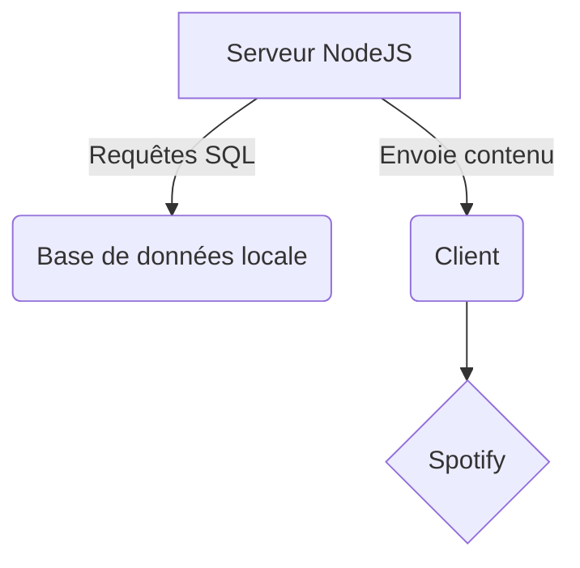


# Présentation générale
Notre jeu est largement inspiré de Guitar Hero ou encore Osu (mode osu!mania).

Quelques différences de fonctionnement cependant : 

* Utiliser les plateforme de **streaming** musicales (uniquement Spotify pour l'instant) : on rend ainsi la partie jeu indépendante de la partie audio. L’utilisateur joue sa musique sur sa plateforme de streaming en arrière-plan, et il joue des notes de la map synchronisée sur notre application.

* On dispose d’un mode **« Enregistrement »** qui permet à un utilisateur de créer sa propre map associée à la musique. Et d’un mode **« Jouer »** qui fonctionne lorsqu’un utilisateur écoute une musique déjà existante dans la base de données. 

Notre jeu est compatible avec la plupart des appareils disposant d'un navigateur internet et surtout bénéficie d'une bibliothèque musicale légale très large grâce à Spotify.
# Technologies utilisées

Back-End            |  Front-end
:-------------------------:|:-------------------------:

|
 

## Schéma global

# Authentification et connexion à Spotify

# Gestion de la base de donnée

# Reprise d'un interface graphique existant : JS-HERO

Afin de partir d'une base graphique existante solide nous avons choisi d'utiliser le projet de Jay Schwartz : [JS-Hero](https://github.com/jyschwrtz/JS-Hero)

Il tire profit de la librairie 3D three.js performante et simple d'utilisation. Le rendu est calculé en local et permet une utilisation relativement légère de la puissance de calcul.

Notre objectif à long terme étant de faire fonctionner le jeu sur mobile : chose, en partie, déjà possible .

## Actions utilisateurs :
### EventListener
* KeyPress/KeyDown
* TouchEvent

