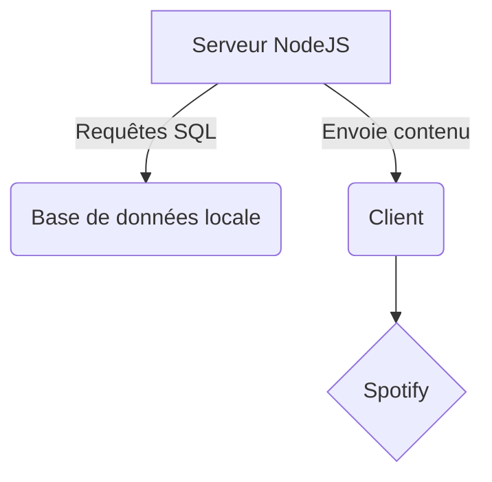


# Présentation générale
Notre jeu est largement inspiré de [Guitar Hero](https://www.guitarhero.com/fr/) ou encore [osu!](https://osu.ppy.sh/home) (mode osu!mania).

Quelques différences de fonctionnement cependant : 

* Utiliser les plateforme de **streaming** musicales (uniquement Spotify pour l'instant) : on rend ainsi la partie jeu indépendante de la partie audio. L’utilisateur joue sa musique sur sa plateforme de streaming en arrière-plan, et il joue des notes de la map synchronisée sur notre application.

* On dispose d’un mode **« Enregistrement »** qui permet à un utilisateur de créer sa propre map associée à la musique. Et d’un mode **« Jouer »** qui fonctionne lorsqu’un utilisateur écoute une musique déjà existante dans la base de données. 

Notre jeu est compatible avec la plupart des appareils disposant d'un navigateur internet et surtout bénéficie d'une bibliothèque musicale légale très large grâce à Spotify.
# Technologies utilisées

Back-End            |  Front-end
:-------------------------:|:-------------------------:
  |  | 

## Schéma global

# Authentification et connexion à Spotify

# Gestion de la base de donnée
## Structure

Nous avons mis en place les 3 tables suivantes :

L’utilisateur est identifié de manière unique par le UserURI **donné par l’authentification Spotify**, et les morceaux par leurs TrackURI donné par la **base de donnée de Spotify**. Ainsi:

* La table **Score** permet à l’utilisateur d’enregistrer son score sur le morceau qu’il vient de jouer à la fin de la partie, son nouveau score remplaçant l’ancien sur le même morceau.

* La table **User** a servi principalement à faire des tests lors de l’intégration de Spotify à notre projet, nous n’avons pas cherché à intégrer plus en détail les informations de l’utilisateur dans le jeu.

* La table **Track** est la plus importante de notre projet, elle permet pour l’instant de stocker une seule beatmap par morceau, mais nous prévoyons en amélioration future de pouvoir associer plusieurs par morceau. Le Trackdelay est un paramètre que nous devons rentrer à la main, Trackname, Trackartist et Trackcover sont fournis par Spotify. Et enfin, les OSUfiles (beatmap) peuvent être soit importés manuellement depuis le site de OSU, soit créés grâce à notre interface de création de beatmap.
## Gestion

La gestion de ces tables est assurée par le moteur SQlite : il n’y a pas de serveur faisant des requêtes à la base de données. **On fait des requêtes SQL sur un fichier local**. Cette méthode est plus simple car on a alors simplement un fichier “main.db” à manipuler.

Les requêtes sont faites à l’URL, mais pour plus de sécurité elles ne sont pas passées simplement au format SQL. Le front-end fait en des requêtes GET POST ou PUT qui sont traitées par un fichier back-end : “dbHandler.js”. C’est ce fichier qui assure la sécurité de notre base de données. Il récupère les requêtes, et avant de les transformer en requêtes SQL **il s’assure qu’elles soient formulées correctement**, par exemple qu’il ne manque aucun élément. Cela empêche un minimum que des données fausses soient rentrées dans notre base. Malgré ces précautions, la base de données n’est pas protégée contre les injections SQL.

# Reprise d'un interface graphique existant : JS-HERO

Afin de partir d'une base graphique existante solide nous avons choisi d'utiliser le projet de Jay Schwartz : [JS-Hero](https://github.com/jyschwrtz/JS-Hero)

Il tire profit de la librairie 3D three.js performante et simple d'utilisation. Le rendu est calculé en local et permet une utilisation relativement légère de la puissance de calcul.

Notre objectif à long terme étant de faire fonctionner le jeu sur mobile : chose, en partie, déjà possible.
|JS Hero  | TC Hero |
|--|--|
|  |  |
Enfin voici les différents pages correspondantes au menu et à l'écran pause de notre jeu :

Et le rendu actuel sur mobile :

## Objets graphiques
La scène three.js se compose essentiellement de :
* **texture 2D** construite à partir de la pochette de l'album de l'artiste écouté
* **BoxGeometry** qui constituent l'ensemble des éléments animés (notes et touches)

On utilise largement la fonction `setTimeout()` afin de faire apparaître les notes en temps voulu à l'écran.

## Actions utilisateurs 
### EventListener
* KeyPress/KeyDown :  pour gérer les événements clavier.
* TouchEvent : dédié aux écrans tactiles: on parvient à récupérer le tableau contenant toutes les positions appuyées simultanément pas l'utilisateur grâce au *multitouch*.

### Vérification des notes jouées
On stocke en permanence un tableau contenant les dernières touches pressées dans les 300ms précédents. Ce fonctionnement nous permet de vérifier avec une certaine persistance la réussite ou non d'une note en autorisant une latence.

# Utilisation d'un format de fichier existant : osu! File Format
Fournir une grande quantité de contenu est indispensable pour notre jeu. C'est pourquoi nous avons choisi de le rendre compatible avec un format de fichier très utilisé : [Osu File Format](https://osu.ppy.sh/help/wiki/osu!_File_Formats/Osu_(file_format)). Ceci nous permet de pouvoir **importer des partitions déjà crées pour ce jeu**. Ces dernières contiennent notamment des objets appelés *HitObjects* qui sont écrits dans les fichiers sous la forme :

    x,y,time,type,hitSound,endTime:addition

Seules ces lignes nous intéressent. Afin de réduire les échanges de données entre le client et le serveur et ne pas avoir de fichier à stocker sur le client, nous avons développé un *parser* qui renvoie un tableau contenant les notes sous le format JSON : 

    {"position" :  position, "startTime":  startTime, "duration" : duration }

Afin de passer d'un format à l'autre on utilise la méthode `parser(txt)` de **osuParser.js**. Cette méthode est appelée côté serveur car c'est lui qui stocke les fichiers `.osu`.

# Gestion du code et management d'équipe

## GitHub
La fonctionnalité de « *versioning* » proposée par Git nous a été indispensable tout au long du projet afin que chacun puisse faire part de ses ajouts au projets en explicitant clairement les changements. 

Au total nous en sommes à plus d'une centaine de commit et chacun a pu suivre l'évolution du projet en temps réel.

## WebPack
Réduire au maximum la dépendance entre les fichiers était une vraie nécessité pour ce projet. En effet, nous avons largement utilisé le caractère *orienté objet* de Javascript côté client pour la réalisation des différentes fonctions :
* Détection des notes jouées
* Création de la scene three.js
* Ajout des éléments graphiques (lumières, notes, touches...)
* Connexion à Spotify et gestion des actions
* Requêtes au serveur pour récupérer/envoyer des données

Ainsi, chaque module pouvait être amélioré indépendamment en limitant les conflits et les opérations de gestion des collision avec `git stash`.

